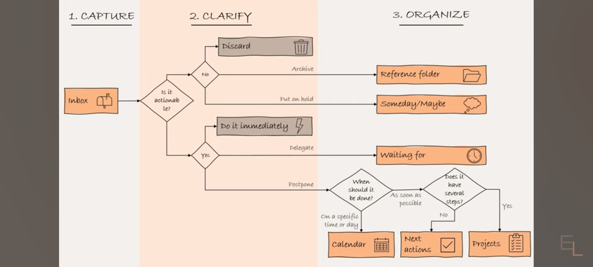

- Libro de [[David Allen]]
- [[libros por leer]]
- Resumen https://youtu.be/bwvl5p77DTA?si=rvaCkhAuMv2PVnpu
- 5 pasos
	- Captura
	- Clarifica
	- Organiza
	- Reflexiona
	- Conecta (engage)
	  collapsed:: true
		-
	- 
	- Agregaría que cualquiera rutinaria hay que evaluar si se puede automatizar
-