- Voy a dejar en esta nota todo lo relacionado con smalltalk
-
- Semana 1
	- Pharo object model
	  collapsed:: true
		- Solo objectos, mensajes y Bloques, es todo lo que hay en pharo
		- los mensajes son el "Que" ... la intención
		- los metodos son el "Como"
		- Los bloques, son como funciones anonimas, Lexical Clousures es el termino correcto
		- Ejemplo:
		  collapsed:: true
			- 4 timesRepeat: [ Transcript show: 'Hello world']
			  collapsed:: true
				- 4 es el objeto o reciber
				- timesRepeat: es el mensaje
				  collapsed:: true
					- mensaje: , los dos puntos indican que el mensaje necesita un argumento
				- [...] lo que esta entre paréntesis cuadrados es un bloque
		- las variables de instancias son protegidas, privadas para los objetos y accesible desde las subclases
		- todos los metodos son privados
		- herencia unica entre clases
	- Sintaxis
	  collapsed:: true
		- 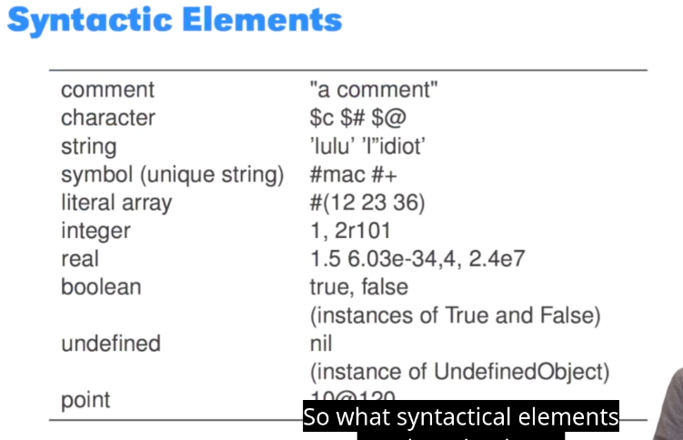
		- 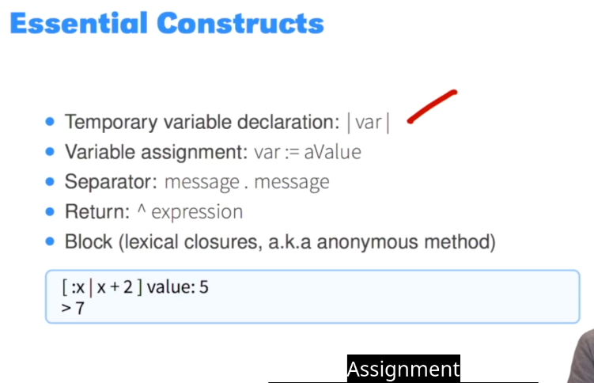
		- Mensajes
		  collapsed:: true
			- 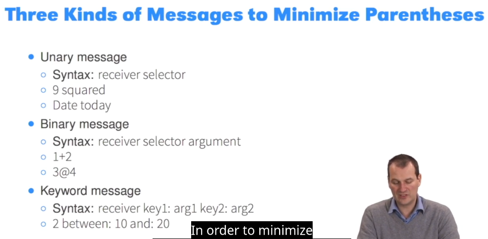
			- los condicionales y loops son mensajes tambien
			  collapsed:: true
				- 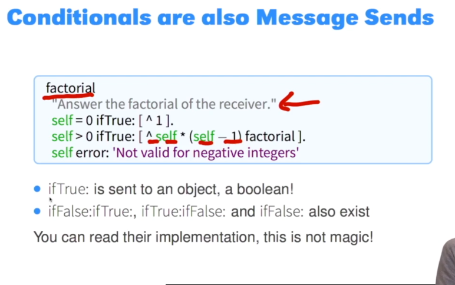
				- 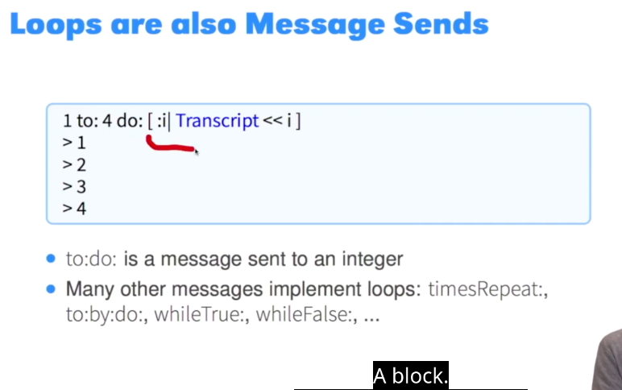
				-
				- 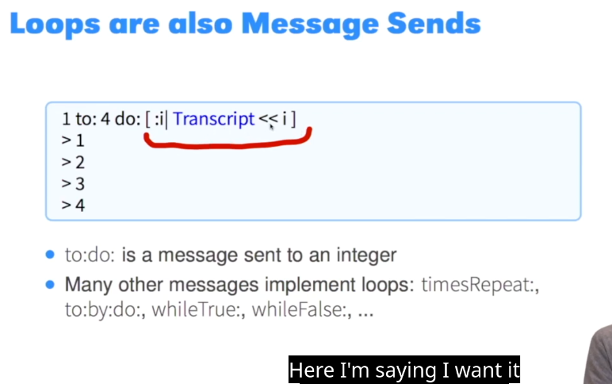
				-
		- definir una clase
		  collapsed:: true
			- 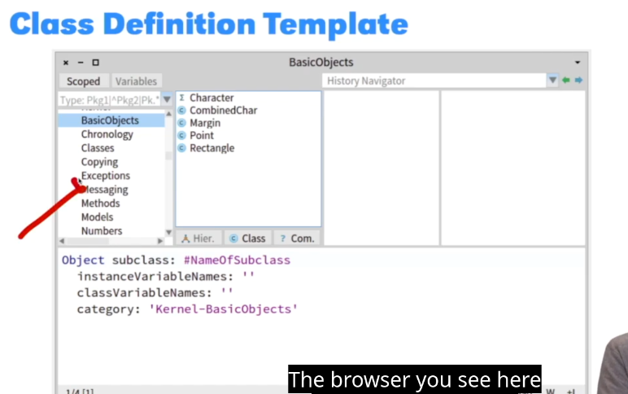
			- las clases pertenecen a pacquetes
			- todos son subclases de Object
			- declaras las variables de instancia / clase como un string separados por espacios
			- category es el nombre del package
			- puedes crear metodos a nivel de instancia a o de clase (static method)
		- definir un metodo
		  collapsed:: true
			- 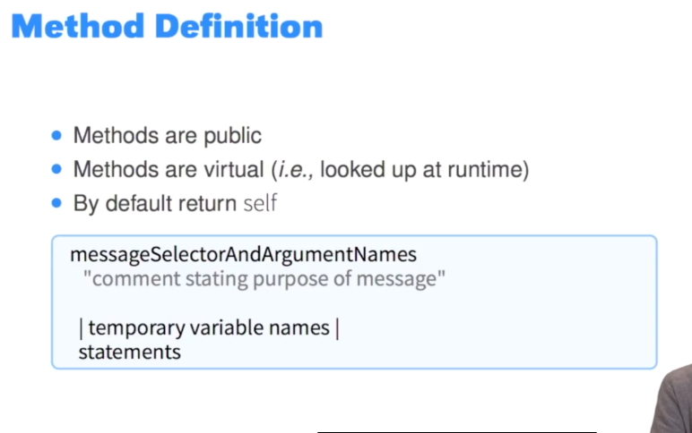
			-
			-
		- Bloques
		  collapsed:: true
			- se pueden asignar a variables
			- se evaluan en tiempo de ejecucion o con el mensaje valure
			  collapsed:: true
				- [...] value
				- pueden tener argumentos
				  collapsed:: true
					- [:x| x+2]
					  collapsed:: true
						- si quiero evaluar esto seria :
						- [:x|x+2] value:5
						  collapsed:: true
							- >7
			- buenas practicas al usar bloques:
			  collapsed:: true
				- 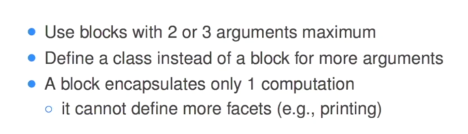
		- Loops
		  collapsed:: true
			- timesRepeat:
			  collapsed:: true
				- 4 timesRepeat: [self doSomthing]
			- to:do:
			  collapsed:: true
				- 1 to: 100 do: [:i|...]
			- Iteradores
			  collapsed:: true
				- 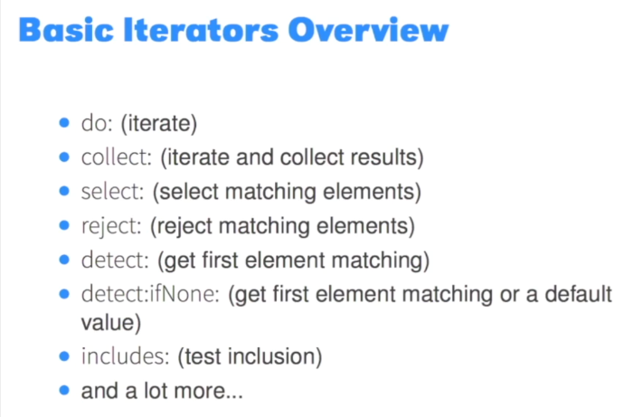
				- [...] whileTrue: [...]
				  collapsed:: true
					- 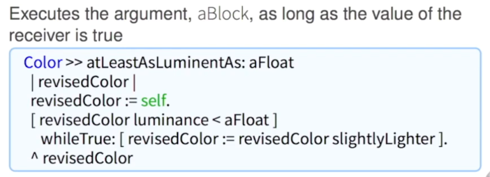
				- booleans y condicionales
				  id:: 66f1eab2-7014-46c3-9751-2fb961690915
				  collapsed:: true
					- eager y lazy
					  collapsed:: true
						- 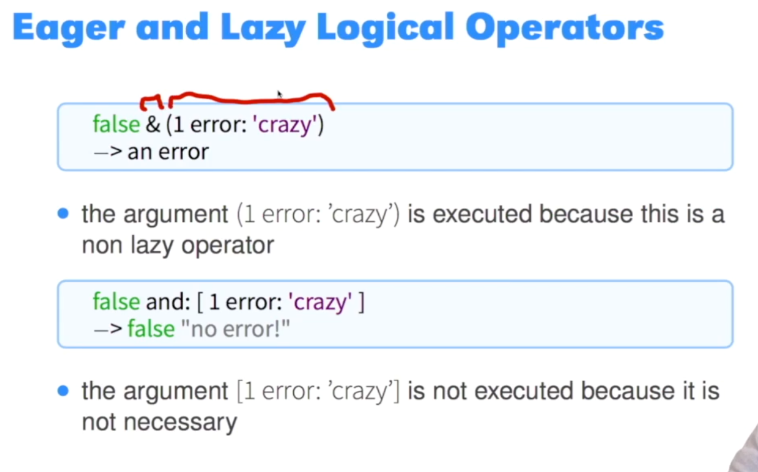
					- condicionales son mensajes
					  collapsed:: true
						- ```smalltalk 
						  Weather isRaining
						  ifTrue: [self takeMyUmbrella]
						  ifFalse: [self takeMySunglasses]
						  ```
						- ifEmpty:[...] , ifNotEmpty:[...] -> se explican solas y se usan en colecciones
				- yourself
				  collapsed:: true
					- se usa en conjunto con cascade ';' para retornar el objeto/reciver original y no el resultado del ultimo menasaje
					- sin yourself:
					  collapsed:: true
						- ```smalltalk 
						  Set new add: 2
						  > 2
						  "retorna un 2 y no un set con un dos dentro"
						  ```
					- con yourself
					  collapsed:: true
						- ```pharo
						  Set new
						  add: 2;
						  yourself
						  >aSet 
						  "esto si retorna un set con el numero dos dentro"
						  ```
				-
				-
				-
				-
- Semana 3 Desing, Class Method and collections
	- Dispatch
	  collapsed:: true
		- Tell, dont ask -> deja que quien reciba el mensaje decida que hacer
			- esa es la "escence of dispatch" entendiendo dispatch como el envio de mensajes
			- en este [vídeo](https://lms.fun-mooc.fr/courses/course-v1:inria+41024+session01/courseware/d7e98db326c243deaa500bcc0e126a84/714307264f5343ff840c929e30d26dde/) muestran una implementación exquisita de Not and Or en boolean sin condicionales
		- enviar un mensaje es como un condicional, por que depende de la clase del reciver. el VM hace el lookup en la clase correcta y ejecuta lo que se necesite. Enviar un mensaje es un "choise operator"
		- Recomienda evitar escribir condicionales (if) ya que se puede hacer lo mismo con objetos, mensajes y la jerarquia de clases para determinar que path de execucion tomar (un poco strategy patern)
	- Variables
	  collapsed:: true
		- las locales comienzan con minusculas
		- las compartidas (como Clases en el sistema, o variables de clases) con Mayuscula
		- existen 6 variables especiales
			- true, false
				- son la variabel unique/singleton de las clases True, False
			- nil
				- es la variable unique de UndefinendObject
			- self
				- se refiere a quien recibe el mensaje (this en otros lenguajes)
			- super
				- idem a self, pero el lookup del metodo comiensa con la clase padre (superClass)
			- thisContext
				- es el executionStack en curso
	- Class methods
	  collapsed:: true
		- como en pharo todos son objetos, las clases tambien y pueden recibir mensajes... idem a los static method
		- habitualmente se pueden usar para crear factory methods
		- recuerda que tienen el keyword class y luego la definicion del metodo
			- ```smalltalk
			  String class>>with: aCharacter
			  | newCollection |
			  ...
			  ```
	- Collections escenciales
	  collapsed:: true
		- tienen una api comun: size, do:,select:, includes:
			- 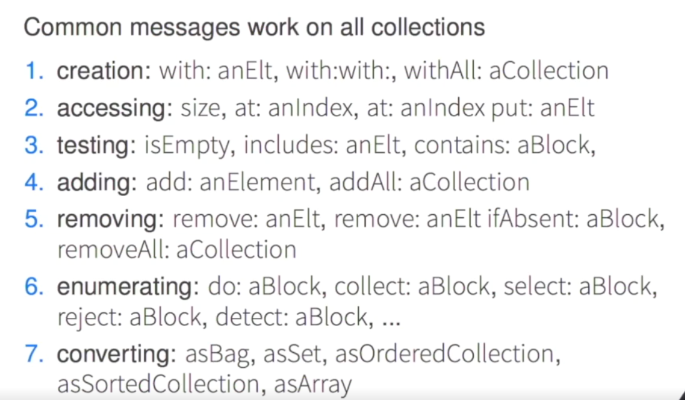
			-
		- el primer elemento es 1 ... no 0
		- OrderCollection(crece dinamicamente)
		- Array (tamaña fijo)
		- Set (sin duplicados)
		- Dictionary (key-pair aka Maps aka hashtable)
			- 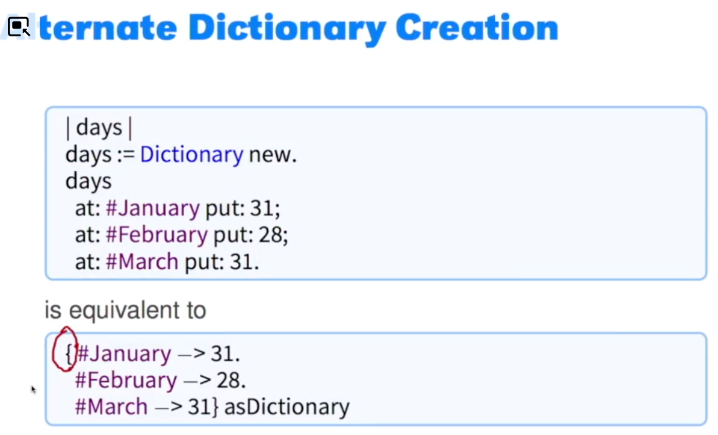
			-
	- Iterators
	  collapsed:: true
		- collect -> equivalente al map
		- select -> equivalente a filter
		- reject -> idem a select pero con negación
		- detect -> equivalente a find ... retorna el primero que encuentra
		- do -> equivalente a forEach
	- Streams
		- idem a stream de java o iterators de otros lenguajes que tienen los metodos .next .previus
		- hacegurate de cerrar el steam con close al final
	- return ^
		- metodo con ^
			- retorna el valor especifico que este luego del ^ y sale del metodo
		- metodo sin ^
			- retorna self por defecto
		- bloque con ^
			- retorna expresion... pero ojo sale del metodo que lo evaluo ... no del bloque.
		- bloque sin ^
			- retorna la ultima expresión del bloque
		-
- Semana 4
	- herencia y lookup
		- estatico para definicion -> asigna sublclase al definirla
		- dinamico para comportamientos -> los metodos se buscan entre super y subclases. Comienza desde la subclase y busca los metodos hasta las superclases
		- los atributos se componene de los atributos padres mas los de la subclase
		- self + super
			- self y super, siempre representa al que recibe el mensaje
			- super, cambiar el lookup comenzando por la clase que este arriba de el
			- invociaciones a self son dinamicas y podrian ejecutar codigo de subclasess (como en double dispatch) 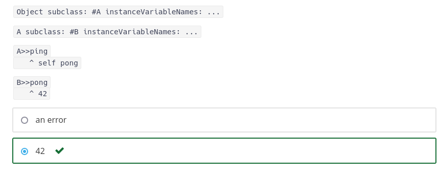
			-
		- DoesNotUnderstand:
			- si el lookup falla, la clase Object tiene un metodo llamado "doesNotUnderstand" este retorna una excepción llamada MessageNotUnderstood. la cual puedes capturar
			- tu clase puede sobreescribir el metodo doesNotUnderstand si asi gustas
			- aca un snippet (que tambien muestra el equivalente a un try-catch) 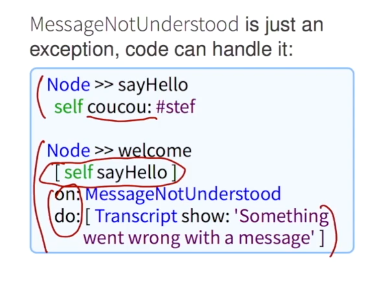
		- class methods
			- ya que todo es objecto en pharo, no son mas que metodos regulares
			- usualmente se usan para crear nuevas instancias pero se pueden usar para otras cosas
			-